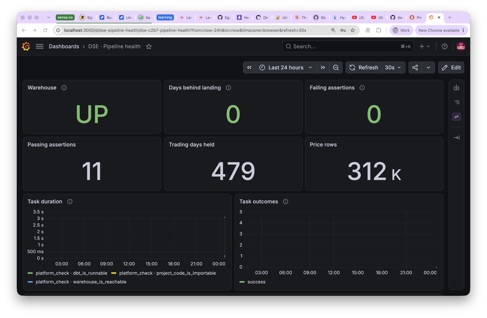
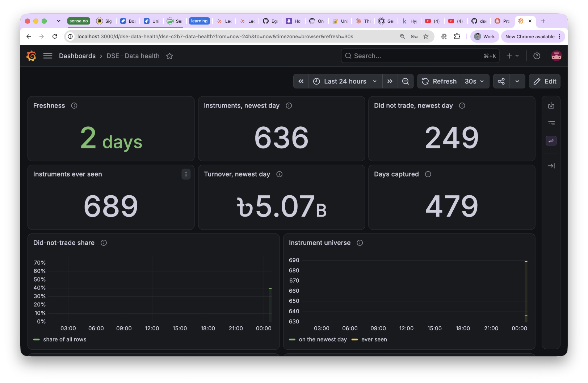

# DSE Market Intelligence Platform

A data platform over Dhaka Stock Exchange market data: daily prices captured,
loaded, modelled, asserted, and served over HTTP.

Built to be **operated and explained**, not to accumulate technologies. Every
non-obvious decision has an [ADR](docs/adr/) saying why the obvious approach was
wrong.

---

## Quick start

From a fresh clone to a running platform. Requires Docker and
[uv](https://docs.astral.sh/uv/); nothing else, and no cloud account.

```bash
uv sync            # install pinned dependencies (uv.lock)
make up            # build and start the whole platform
```

`make up` creates `.env`, generates local secrets, and starts six services: the
warehouse, Airflow's own database, its api server, scheduler and dag processor.
It prints the Airflow URL and username; the password is in `.env` as
`AIRFLOW_ADMIN_PASSWORD`.

```bash
make test          # drives a landed fixture all the way to an HTTP response
```

`make test` is the honest proof the platform works, and it creates and drops its
own database so it can never touch real data.

To load real prices and serve them:

```bash
make reload        # load everything already landed, then build the models
make api           # read-only price API on :8000
```

```bash
curl 'localhost:8000/v1/instruments/GP/prices?start_date=2026-09-01'
curl localhost:8000/v1/trading-days
open http://localhost:8000/docs        # the published schema
```

`make down` stops the platform and keeps the data. `make destroy` deletes the
warehouse and Airflow's history with it.

---

## Operating the pipeline

Two DAGs run in Airflow.

**`dse_market_daily`** runs at 13:00 UTC — 19:00 in Dhaka, several hours after
the exchange's 14:30 close. It captures a trading day, loads it, and rebuilds
every model and assertion. Each dbt model and each assertion is its own task, so
a failing assertion names the model and the rule in the graph rather than hiding
inside one green box.

**`dse_freshness_check`** runs hourly and raises the alerts nothing else would.
It watches two different broken things:

| Alert | What it means |
|---|---|
| `landing is N days behind` | Capture stopped, or this machine was off |
| `warehouse is N days behind landing` | Capture works; the load or dbt does not |

The second is the quiet one. The pipeline can be entirely green while the
warehouse falls further behind, and that is exactly what happened before any of
this was orchestrated.

### Watching it

Two Grafana dashboards, provisioned from files in this repository so they exist
on a fresh clone rather than living in one person's browser.

**Pipeline health** — is the machinery running? Task durations and outcomes from
Airflow, plus days-behind-landing over time, which should sit flat at zero.

**Data health** — is the result worth trusting? Freshness, volumes, the
did-not-trade share, the instrument universe, and assertion counts.





The second is the one worth showing someone. A green DAG proves tasks ran; a
chart of the did-not-trade share holding near 0.39 across two years is evidence
the data is understood. The instrument-universe panel shows the same thing from
another angle — the gap between "ever seen" and "on the newest day" is 53
delistings, mostly treasury bonds reaching maturity.

Metrics come from two places on purpose. Airflow's own, via StatsD, say whether
tasks ran. A small exporter reads the warehouse directly and says whether the
data is right — which a green pipeline cannot tell you.

One detail worth knowing: when the warehouse is unreachable the exporter emits
`dse_warehouse_up 0` and **nothing else**. Freshness is absent rather than zero,
because a zero would render as "perfectly current" on every panel.

### When it breaks

[Runbooks](docs/runbooks/) cover each failure mode: a red task, a refused day, a
failing assertion, data going stale with nothing failing, an outage, and Airflow
refusing to start. Each begins with how to *confirm* the diagnosis, because the
symptoms overlap — a stale warehouse looks identical whether capture stopped, the
load stopped, or the exchange was simply closed.

One rule ranks above the rest: **deal with capture first.** The warehouse can
always be rebuilt from landing. Landing cannot be rebuilt from anything, and the
archive is a rolling two-year window.

### Recovering after the platform has been off

The exchange serves a **rolling two-year window**, so a trading day that is never
captured eventually becomes unrecoverable. After an outage, catch up promptly.

```bash
make up
```

Each scheduled run already re-covers a three-day trailing window, so a short
outage heals itself on the next run. For anything longer, run a backfill:

```bash
docker compose exec airflow-scheduler \
  airflow backfill create --dag-id dse_market_daily \
  --from-date 2026-09-01 --to-date 2026-09-14 \
  --max-active-runs 1 --run-backwards
```

**Mind the dates.** `--from-date` and `--to-date` are *logical* dates, and a run's
trading day is the day its interval **ends** — one day later. A backfill from
`2026-09-01` to `2026-09-03` processes trading days **09-02 and 09-03**. If you
want a specific trading day, ask for the day before it.

`--max-active-runs 1` keeps the backfill from putting a burst of load on a public
exchange site. `--run-backwards` processes the newest dates first, which gets the
warehouse current soonest — usually what you want after an outage.

Re-running a date that already loaded is safe and asserted: loading replaces a
trading day atomically, so a backfill over dates you already have leaves the
warehouse byte-identical. Dates with no session complete without writing
anything.

---

## How data moves

```
     DSE day-end archive  (rolling 2-year window)
                │
                ▼
   landing   original response bytes, gzipped, never modified
                │           ingestion/capture_day_end.py
                ▼
   raw       one table per feed, the exchange's own column names, all text
                │           ingestion/load_day_end.py
                ▼
   staging   typed, renamed into this project's vocabulary
                │
                ▼
   marts     dim_instrument, fact_daily_price
                │           dbt
                ▼
   FastAPI   read-only price series
```

Those five names are the only layer vocabulary in the project. Bronze, silver
and gold are not used ([ADR 0003](docs/adr/0003-layer-vocabulary.md)) — three
overlapping vocabularies for the same thing is how a pipeline becomes
unexplainable.

**Python owns everything above `raw`; dbt owns everything below it**
([ADR 0004](docs/adr/0004-python-ingests-dbt-transforms.md)). Python fetches
bytes, lands them, and loads them with no coercion beyond "make it text". Every
join, derivation and business rule after that is SQL. That constraint is what
keeps the lineage graph honest.

---

## Things that will surprise you

Each of these has already invalidated an assumption, and each is why some piece
of the code looks the way it does.

**The source column order is `LTP, HIGH, LOW, OPENP, CLOSEP` — not OHLC.**
A parser that assumes OHLC produces plausible, correctly typed, wrong prices
that no schema assertion rejects. This is the highest-risk failure in the
project, which is why `tests/expectations.py` asserts every price field exactly
and why every value in the fixture differs from every other on its row.

**The archive is a rolling two-year window.** A trading day not captured is
unrecoverable. That is why capture runs on a schedule before the rest of the
platform existed, and why `landing` stores original bytes rather than parsed
Parquet — a parsing bug found in month eighteen is fixable by reparsing, but not
by refetching ([ADR 0002](docs/adr/0002-landing-holds-original-bytes.md)).

**Roughly 39% of daily rows did not trade.** Open, high, low and last traded
price arrive as zero. Zero is not a price, so they become NULL and
`did_not_trade` is set; left as zero they would drag every moving average toward
zero across a third of the data with nothing failing
([ADR 0006](docs/adr/0006-did-not-trade-is-modelled.md)).

But the **close survives**, because the exchange publishes one even for
instruments that never trade. `TB10Y0127`, a treasury bond, has never traded in
the window and still closed at 97.38, 97.40, 96.97, 97.49 on consecutive days —
a valuation. Nulling it would erase the only price such instruments have.
Volume, turnover and trade count stay zero, because zero is the truth.

**The close is not the last traded price.** The exchange publishes both and they
differ; `close_price` is the official weighted close, which is what the published
previous close compares against
([ADR 0007](docs/adr/0007-close-price-is-the-official-close.md)).

**Turnover is published in millions of taka.** Converted once, in `staging`.
Converting again in the loader would silently multiply by a million.

**636 instruments, not ~300 companies** — including bonds and treasury bills. The
dimension is `dim_instrument`, never `dim_company`
([ADR 0005](docs/adr/0005-instrument-is-the-entity.md)).

**The exchange's TLS chain is incomplete.** It omits its Sectigo intermediate, so
`ingestion/certs/` pins it. `curl` only appears to work because it chases the
certificate's AIA URL. Do not "fix" this by disabling verification.

---

## Prices are unadjusted

`fact_daily_price` holds **unadjusted prices and always will**. There is
deliberately no `adjusted_close` column.

An adjusted price is not a fact about a trading day — it is a function of every
corporate action *since* that day. Stored as a column, a bonus issue declared
next year silently changes prices you published this year, with no row updated
and nothing recording why. So adjusted series are derived, never stored
([ADR 0008](docs/adr/0008-adjusted-prices-are-derived.md)).

Series are **price return**, never total return: cash dividends are never
adjusted for ([ADR 0010](docs/adr/0010-price-return-not-total-return.md)). The
API says so in every response, as `price_basis`.

Adjustment is decided but not yet built. See [PLAN.md](PLAN.md) §4.

---

## Grain

`fact_daily_price` is **one row per instrument per trading day**, unique on
`(instrument_key, trade_date)`. A row exists whether or not the instrument
traded, so a gap in a series means missing data rather than a quiet day.

---

## Data assertions

These are contracts on the data, not tests of code. They run in `dbt build`, in
operation, and their job is to fail when the exchange publishes something wrong.

| Assertion | Scope |
|---|---|
| Grain is unique | every row |
| Trading code, trade date, flag not null | every row |
| Every fact resolves to an instrument | every row |
| High is highest, low is lowest | traded rows only |
| Nothing is negative | every row |

The OHLC rules are restricted to traded rows because an unrestricted
`high >= close` evaluates `0 >= 1060` on a non-traded row and fails on 39% of
the data. A test that fails on a third of the data is a test that gets switched
off. Each assertion is watched failing against deliberately corrupt data in
`tests/test_value_assertions.py` — a green suite says nothing about an assertion
that could never fire.

---

## Configuration

All configuration is environment-driven. `make up` creates `.env` from
[.env.example](.env.example), which lists every variable, and generates the
Airflow secrets locally. No credential is committed, and `.env` is gitignored.

**Exchange data never enters this repository.** The exchange permits personal,
non-commercial use and prohibits redistribution, so `landing/` is gitignored, the
capture workflow commits to a separate private repo, and there is no public price
endpoint. Test fixtures are hand-built responses of a few instruments, never a
captured day ([ADR 0001](docs/adr/0001-two-sources-and-private-data.md)).

---

## Where to look

| | |
|---|---|
| [PLAN.md](PLAN.md) | scope, sequence, what is deliberately not built, open questions |
| [CONTEXT.md](CONTEXT.md) | the glossary. Prescriptive: terms to use, and to avoid |
| [docs/adr/](docs/adr/) | ten decisions, each because the obvious approach was wrong |
| [docs/specs/](docs/specs/) | the spec for this slice |
| [docs/tickets/](docs/tickets/) | how it was broken down and built |
| [docs/runbooks/](docs/runbooks/) | what to do when it is red |
